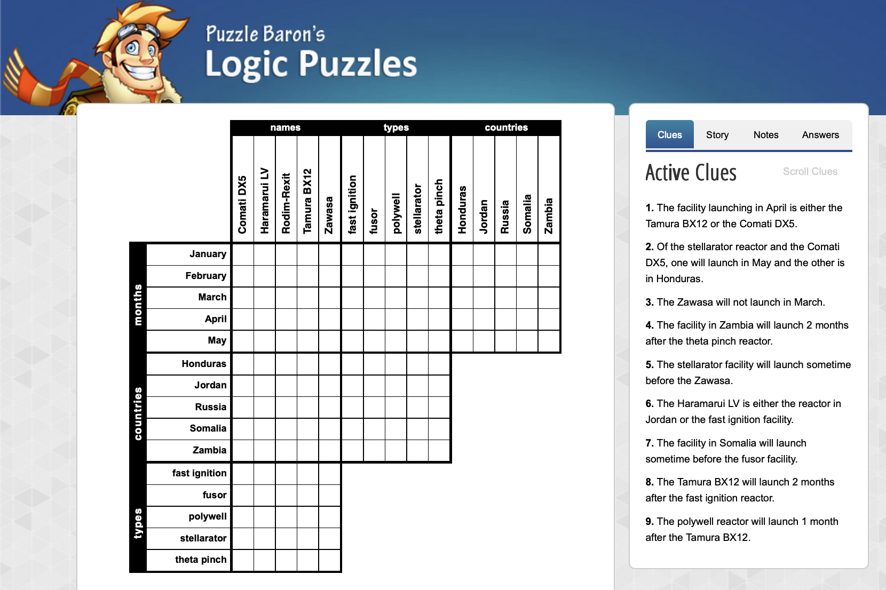
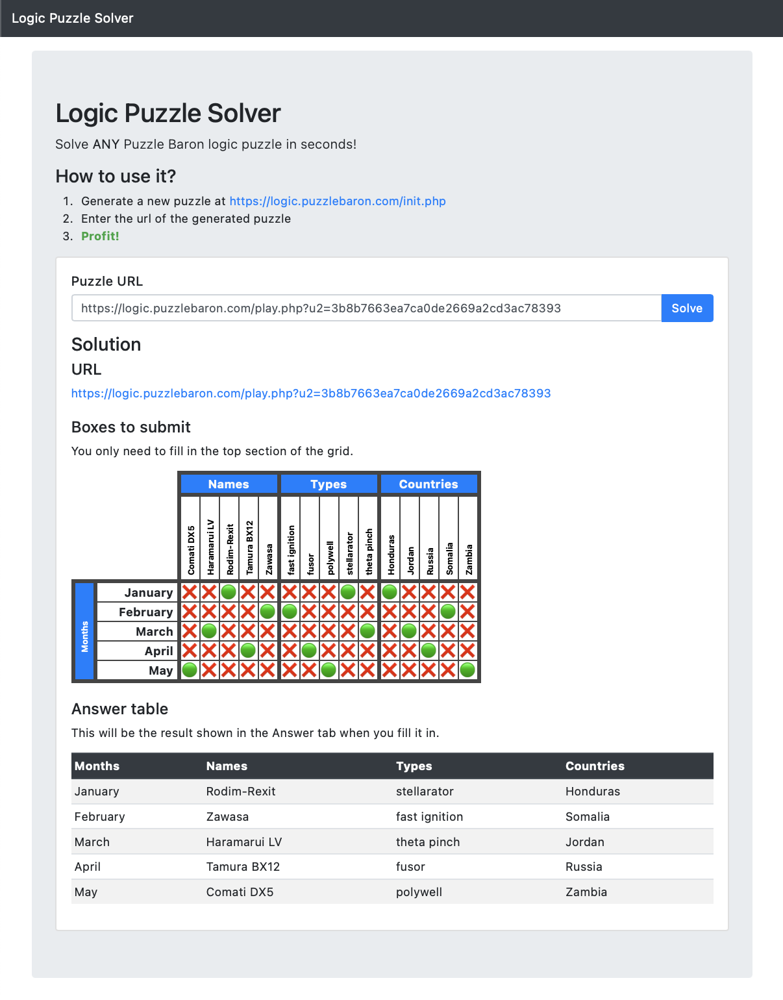

# logic-puzzle-solver
This is the frontend for the Puzzle Baron <a target="_blank" href="https://darcipeoples.com/logic-puzzle-solver/">Logic Puzzle Solver</a>. Read more about it on <a target="_blank" href="https://darcipeoples.com/">darcipeoples.com</a>.

## Screenshots
### Example Puzzle Input

Generate a puzzle at <a target="_blank" href="https://logic.puzzlebaron.com/init.php">logic.puzzlebaron.com</a>.



### Example Solver Output

Enter the puzzle URL into the <a target="_blank" href="https://darcipeoples.com/logic-puzzle-solver/">Logic Puzzle Solver</a> to automagically solve it.



## How to Run it
### Start an HTTP Server
```
python3 -m http.server 8000
```

Set the `serverEndpoint` in `index.html` to either the local Flask server or the AWS API Gateway.

If wanting to call AWS locally, temporarily add `localhost:8000` to the API Gateway CORS.

NOTE: To call AWS, we have to start an HTTP server, so that the CORS Origin gets set. We also have to disable authentication and enable CORS in the AWS API Gateway. The HTTP server is needed to load the navbar HTML properly (as opposed to opening `index.html` in browser).